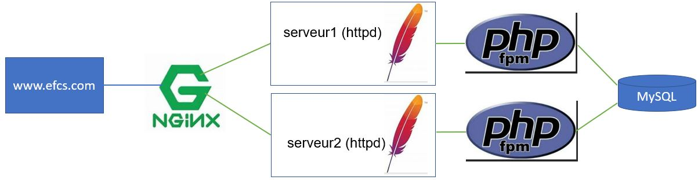

# TP3 et EFCS (partie pratique)
# Déploiement dans un environnement avec Ansible

## Informations

- Évaluation : 25 % de la session (15 % pour le TP3 directement et 10 % pour L'EFCS)
- Type de travail : individuel
- Date de remise : 1 mars 2023
- Durée : 10 heures, dont 2 séances (24 février et 27 février). 
- Système d’exploitation : Linux Ubuntu / Docker
- Environnement : Docker

## Énoncé
Le but de cette épreuve à caractère synthèse a pour objectifs :  
- Faire une installation complète d’un site Web avec équilibrage de charge.  
- Utiliser Nginx comme un équilibreur/répartiteur de charge (load balancer).  
- Utiliser Apache (httpd) comme serveur de contenus.  
- Utiliser php-fpm comme fastCgi.  
- Utiliser MySQL comme serveur de base de données.  
- Le tout automatisé avec Ansible.  

## Description de l'infrastructure

Nginx est utilisé comme équilibreur de charge pour avoir une structure comme celle-ci :




**Attention :** même si sur l'image les deux serveurs php point vers un seul serveur MySQL, vous allez implanter 2 serveurs MySQL.

Donc, on se connecte sur <code>www.efcs.com</code> qui appelle le proxy nginx qui lui appelle en alternance les serveurs 1 et 2. Chacun des serveurs est relié à un serveur php et à un serveur MySQL.  

- Vous aurez trois VMs serveurs : une pour l'équilibreur de charge et deux pour les serveurs Web (n'oubliez pas de renommer vos VMs, de créer les utilisateurs...) 
- Les services seront des conteneurs.  
- Les deux serveurs web doivent être identiques, à part une information, dans la page Web, qui permet de distinguer le serveur 1 et le serveur 2 : par exemple le hostname ou/et l'adresse IP.  
- Les serveurs httpd seront reliés à un réseau avant pour la communication extérieur.  
- Les serveurs httpd auront chacun leur réseau arrière pour communiquer avec leurs serveurs php et MySQL.  
- Le fichier de configuration de httpd.conf doit être monté par un point de montage au fichier httpd.conf du conteneur.
- Le contenu des serveurs httpd doit être monté par un point de montage à un répertoire de la VM.  
- Le serveur MYSQL doit avoir un volume de données persistant dans la VM.  
- Vous devrez démontrer le système fonctionnel.  

**Attention :** ne mettez pas de dépendance aux serveurs httpd.

## Ansible 

### Un fichier d'inventaire en format YAML doit contenir :

- Tous les hôtes via le groupe "all" et ils devront avoir pour login <code>admin</code>.  
- Les clients devront faire partie d'un groupe appeler "prod".  
- Le mot de passe à utiliser pour toutes les connexions ssh devra être admin pour toutes les machines du groupe "prod".  
- Les mots de passe doivent être placés dans un fichier chiffrer par Ansible Vault. Le mot de passe pour l'Ansible Vault est <code>secret</code>.  
- La variable "env" devra être égale à "production" pour toutes les machines du group "prod". La variable doit être placée dans une variable de groupe.  

### Vous devez avoir des playbook pour :

- LoadBalancer
- Web : gère également php et MySQL

### Votre déploiement :

- Se fait avec une seule commande et reproduit toute l'architecture : vous allez avoir un playbook nommé <code>deploiement.yaml</code>.

## Remise 
Vous devez fournir (déposé sur LÉA) :

- L'adresse de votre dépôt GitHub dans un fichier texte.
- Des captures d'écran dans un document Word :  
	- la page Web de vos deux serveurs;  
	- votre commande pour lancer le projet;
	- l'affichage final d'ansible indiquant les OKs et le nombre de changements.  

Vous devez fournir (déposé sur GitHub) :

  - Un dépôt privé avec votre code source du TP3.  
  - Tous les fichiers de votre travail.    


## Évaluation :
|Item ||Points  |
--- | --- | --- |
|LoadBalancer ||
||Définition des 2 serveurs|5|
||Contexte serveur|5|
|Serveur1/Serveur2 ||
||httpd|5
||php|5
||Lien entre php et MySQL |5
||Page Web d'identification |5
|Commandes ||
||Ansible|40|
||Voir les logs |10|
|Compréhension||10|
|**Total** ||**100**|

## Informations supplémentaires :

Pour créer un playbook qui regroupe tous les playbook, vous utilisez le module <code>import_playbook</code>.

```yaml
---
- name: Configure LoadBalancer
  ansible.builtin.import_playbook: loadBalancer.yaml
- name: Configure les serveurs Web
  ansible.builtin.import_playbook: Web.yaml

```

Vous pouvez utiliser le module <code>copy</code> dans un playbook :

```yaml
  tasks:
    - name: Telecharger Application
      copy:
        src: ./index.php
        dest: /home/admin/html/index.php
        mode: 0755

```

Pour organiser vos fichiers, vous pouvez créer des répertoires avec le module <code>file</code> :

```yaml
  tasks:
    - name: Creates directory
      ansible.builtin.file:
        path: /home/admin/html
        state: directory
        owner: admin
        group: admin
        mode: 0775
```

## Références :

[Documentation ansible pour fichier inventaire avec des relations parent/enfant](https://docs.ansible.com/ansible/latest/inventory_guide/intro_inventory.html#grouping-groups-parent-child-group-relationships)  
[Documentation ansible pour group_vars](https://docs.ansible.com/ansible/latest/inventory_guide/intro_inventory.html#organizing-host-and-group-variables)  
[Documentation ansible pour import_playbook](https://docs.ansible.com/ansible/latest/collections/ansible/builtin/import_playbook_module.html)  
[Documentation ansible pour copy](https://docs.ansible.com/ansible/latest/collections/ansible/builtin/copy_module.html)  
[Documentation ansible pour file](https://docs.ansible.com/ansible/latest/collections/ansible/builtin/file_module.html#file-module)  
[Documentation de Community.Docker](https://docs.ansible.com/ansible/latest/collections/community/docker/index.html#description)  
[Documentation pour une adresse statique sur un serveur Ubuntu 22.04](https://www.linuxtechi.com/static-ip-address-on-ubuntu-server/)  
[Documentation pour l'utilisation de la fonction php_uname](https://www.php.net/manual/en/function.php-uname.php)
